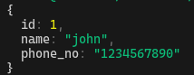

# SQLite3 with JavaScript and Bun.js

## Overview

This project demonstrates a basic implementation of SQLite3 with JavaScript and Bun.js. It includes a testing file, `run.js`, to verify the execution of data and a main file, `app.js`, for the application logic.

## Output



## Prerequisites

- Install Node.js
- Install SQLite3
- Install Bun.js

## Installation

1. Clone the repository:

   ```bash
   git clone https://github.com/your-username/your-repository.git
   cd your-repository
   bun install
   ```

1. Run the application:

   ```bash
   bun run app.js
    or
   bun run run.js
   ```
